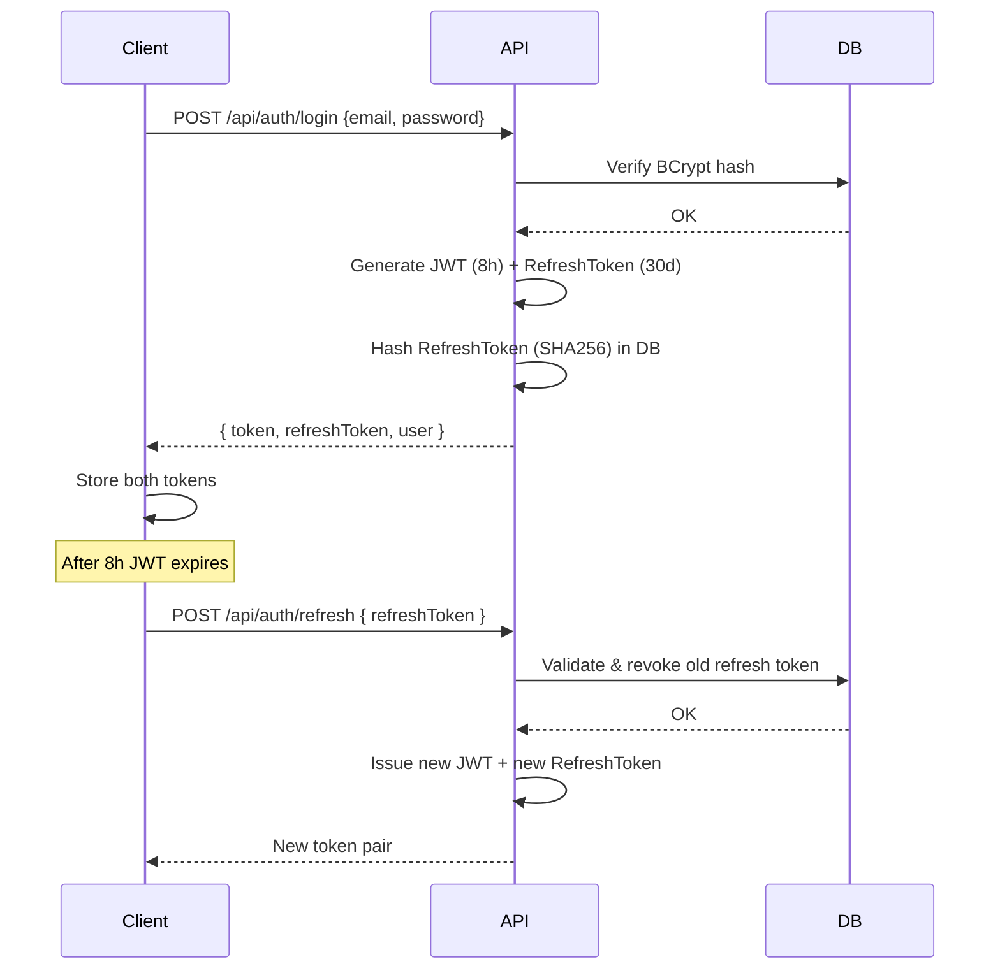

# API Overview

## Base Configuration

| Property | Value |
|----------|-------|
| **Base URL** | `/api` |
| **Auth Header** | `Authorization: Bearer <jwt_token>` |
| **Date Format** | UTC ISO 8601 (`2026-06-09T14:30:00Z`) |
| **Pagination** | `?page=1&pageSize=20` |
| **Error Response** | `{ "message": "...", "errors": ["..."] }` |

## Authentication Flow



### Token Specifications

| Token | Lifetime | Storage | Security Notes |
|-------|----------|---------|----------------|
| **JWT** | 8 hours | Client-side (localStorage / cookie) | `ValidateIssuer = false`, `ValidateAudience = false` — server-side only |
| **RefreshToken** | 30 days | Client-side + DB hash | Stored as SHA256 hash in DB; rotation on each refresh |

## Error Format

All errors return structured JSON:

```json
{ "message": "Description of the error", "errors": ["Optional secondary errors"] }
```

| Status Code | Exception Type | Meaning |
|-------------|---------------|---------|
| `400` | `BadRequestException` | Invalid input or operation |
| `401` | `UnauthorizedAccessException` | Missing or invalid credentials |
| `403` | `ForbiddenException` | Insufficient permissions / wrong role |
| `404` | `NotFoundException` | Resource not found |
| `409` | `ConflictException` | Duplicate key or conflicting state |

## Role-Based Access Summary

| Endpoint Group | Roles Allowed |
|---------------|---------------|
| `/api/auth/login`, `/register`, `/refresh` | Public (no auth) |
| `/api/menu/*` | Public (GET), Admin (POST/PUT/DELETE) |
| `/api/orders/*` | Admin, Waiter, Kitchen |
| `/api/orders/{id}/items/*` | Admin, Waiter only |
| `/api/payments/*` | Admin, Waiter |
| `/api/reservations` | Public (+ optional JWT), Admin/Waiter (GET/PUT/DELETE) |
| `/api/tables/*` | Admin (except GET — public) |
| `/api/users/*` | Admin only |

---

*Next: [02-authentication](./02-authentication.md)*
