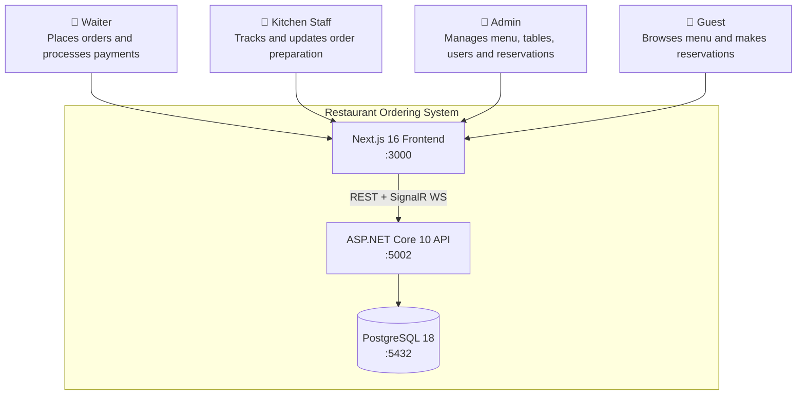
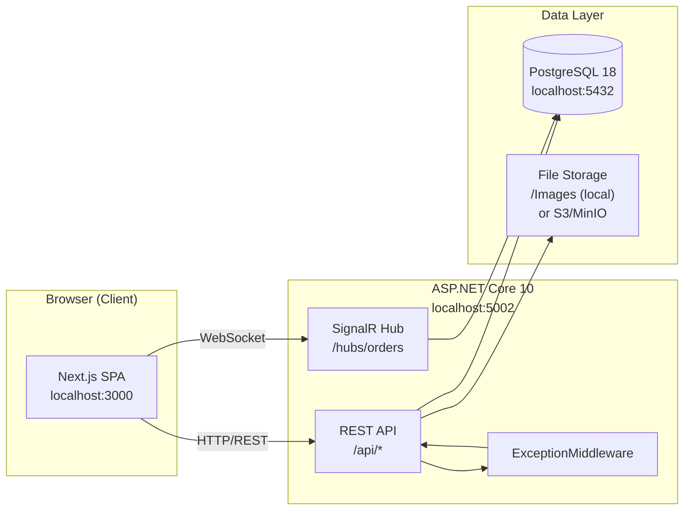
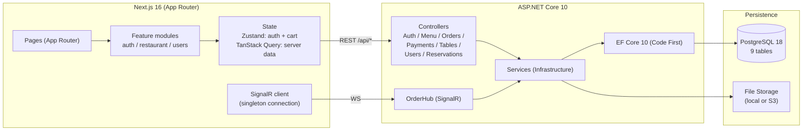

# System Overview

## What the System Does

The Restaurant Ordering System is a multi-role staff tool that covers the full lifecycle of a restaurant table service: from menu browsing and order creation, through kitchen preparation, to payment and table release.

Three roles operate the system simultaneously:

| Role | Primary Workflow |
|------|-----------------|
| **Waiter** | Browse menu, build cart, place orders, process payments, manage order status |
| **Kitchen** | See incoming orders in real time, mark orders preparing → ready |
| **Admin** | Manage menu items and categories, manage tables, manage staff users, view dashboard stats, handle reservations |

A public-facing layer allows guests to browse the menu and submit reservation requests without authentication.

---

## C4 Context Diagram

---

## Deployment Topology

### Port Map

| Service | Port | Protocol |
|---------|------|---------|
| Frontend (Next.js) | 3000 | HTTP |
| Backend API | 5002 | HTTP |
| SignalR Hub | 5002 | WebSocket (upgrades from HTTP) |
| Swagger UI | 5002 | HTTP (`/swagger`) |
| PostgreSQL | 5432 | TCP |

---

## Service Architecture

---

## Technology Decisions

| Decision | Choice | Rationale |
|----------|--------|-----------|
| Backend framework | ASP.NET Core 10 | Mature, strongly typed, built-in DI, EF Core integration |
| ORM | EF Core 10 Code First | Migrations-as-code, LINQ query safety, no raw SQL drift |
| Auth | JWT + BCrypt + refresh tokens | Stateless API with secure token rotation |
| Real-time | SignalR | WebSocket with HTTP long-poll fallback, group broadcast support |
| Frontend | Next.js 16 (App Router) | Server components, route-based code splitting, Vercel-compatible |
| UI | shadcn/ui + Radix | Accessible primitives, no runtime CSS-in-JS overhead |
| State | Zustand (auth + cart) + TanStack Query (server) | Clear separation of local state vs. cached server data |
| Database | PostgreSQL 18 | ACID transactions, reliable decimal precision for pricing |

---

## Key Invariants

- **Price snapshot**: `order_items.price_at_order` is captured at order creation time and never recomputed from `menu_items.price`. Invoices always reflect what was quoted at order time.
- **Table state lifecycle**: creating an order sets the table `Occupied`; serving the final order on a table releases it back to `Free`.
- **Role hierarchy**: Admin can perform any role's actions. Kitchen and Waiter are strictly scoped.
- **Bilingual content**: all menu-facing text (category names, item names, descriptions) is stored in both English (`_en`) and Kurdish (`_ku`) columns. The frontend selects the active language at runtime.

---

*Next: [02-layer-architecture](./02-layer-architecture.md)*
