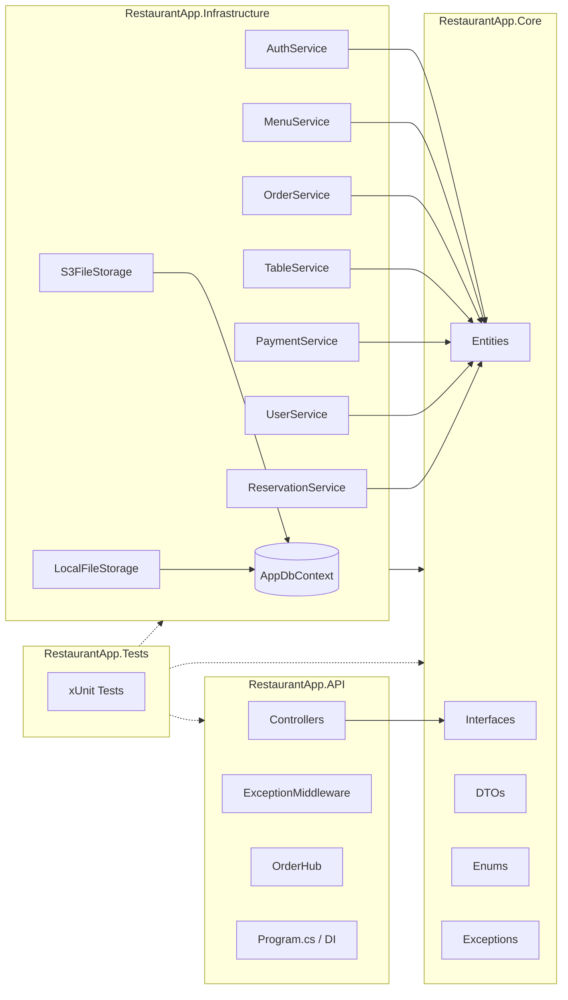
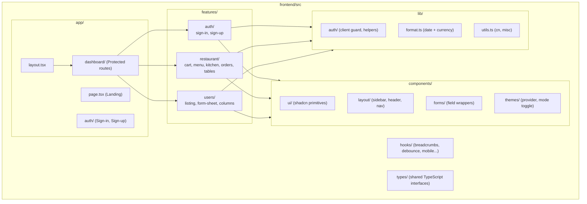

# Layer Architecture

## Backend — Three-Layer Design



**Core never references Infrastructure.** Interfaces are defined in Core; implementations live in Infrastructure. All dependencies point inward — this is the Dependency Inversion Principle applied to project layers.

### Project Responsibilities

| Project | Role | Key Contents |
|---------|------|-------------|
| `RestaurantApp.Core/` | Domain + contracts | Entities, DTOs, Enums, Interfaces, Custom exceptions |
| `RestaurantApp.Infrastructure/` | Persistence + services | EF Core `AppDbContext`, Services, AutoMapper profiles, FileStorage implementations |
| `RestaurantApp.API/` | HTTP surface | Controllers, `OrderHub` (SignalR), `ExceptionMiddleware`, `Program.cs` / DI registration |
| `RestaurantApp.Tests/` | Quality assurance | xUnit test projects covering services and controllers |

### Dependency Flow

```
RestaurantApp.API
    └── depends on → RestaurantApp.Core (interfaces + DTOs)
                  → RestaurantApp.Infrastructure (registered via DI)

RestaurantApp.Infrastructure
    └── depends on → RestaurantApp.Core (entities + interfaces)

RestaurantApp.Core
    └── depends on → nothing (no outbound references)
```

Controllers depend only on `IXxxService` interfaces from Core. The concrete service implementations are injected at startup via `Program.cs`.

---

## Backend — Request Pipeline

```
HTTP Request
    → ExceptionMiddleware (wraps entire pipeline)
    → Authentication middleware (JWT validation)
    → Authorization middleware (role check)
    → Controller action
        → Service (Infrastructure)
            → AppDbContext (EF Core)
            → OrderNotifier → SignalR Hub (for order events)
    → Response (DTO serialized as JSON)
    → ExceptionMiddleware (catches custom exceptions → structured error JSON)
```

---

## Frontend — Feature-Sliced Architecture



### Feature Module Structure

Each feature module follows the same internal layout:

```
features/<name>/
├── api/
│   ├── types.ts          ← TypeScript interfaces (DTOs)
│   ├── service.ts        ← Typed fetch helpers
│   ├── queries.ts        ← TanStack Query hooks (useQuery, useSuspenseQuery)
│   └── mutations.ts      ← TanStack Mutation hooks (useMutation)
├── components/           ← UI components for this feature
└── schemas/              ← TanStack Form + Zod validation schemas
```

### Page Routing

| Route | Feature | Auth Required | Roles |
|-------|---------|:------------:|-------|
| `/` | Landing page | — | All |
| `/auth/sign-in` | Login | — | All |
| `/auth/sign-up` | Registration | — | All |
| `/dashboard` | Admin overview (stats, KPIs) | ✓ | Admin |
| `/dashboard/kitchen` | Kitchen display board | ✓ | Kitchen, Admin |
| `/dashboard/restaurant` | Waiter menu access | ✓ | Waiter, Admin |
| `/dashboard/restaurant/cart` | Cart + table selection | ✓ | Waiter, Admin |
| `/dashboard/restaurant/menu` | Menu admin (CRUD + categories) | ✓ | Admin |
| `/dashboard/restaurant/tables` | Table management | ✓ | Admin |
| `/dashboard/users` | User management | ✓ | Admin |
| `/reserve` | Public reservation form | — | All (anonymous) |
| `/privacy-policy` | Static legal page | — | All |
| `/terms-of-service` | Static legal page | — | All |

---

## Cross-Cutting Concerns

| Concern | Implementation |
|---------|---------------|
| Error handling | `ExceptionMiddleware` maps custom exceptions to HTTP status codes |
| Auth | JWT bearer token validated by ASP.NET Core middleware; refresh tokens stored as SHA256 hash in DB |
| Audit trail | `CreatedAt` / `UpdatedAt` fields on all entities, set by EF Core interceptors |
| Decimal precision | `(18,2)` enforced on `Price`, `PriceAtOrder`, `Amount` in `OnModelCreating` |
| Cascade deletes | Defined explicitly per relationship in `OnModelCreating`; `OrderItem → MenuItem` uses `Restrict` to protect order history |
| Image upload | `IFileStorage` abstraction with `LocalFileStorage` (dev) and `S3FileStorage` (prod) implementations |

---

*Next: [03-domain-model](./03-domain-model.md)*
