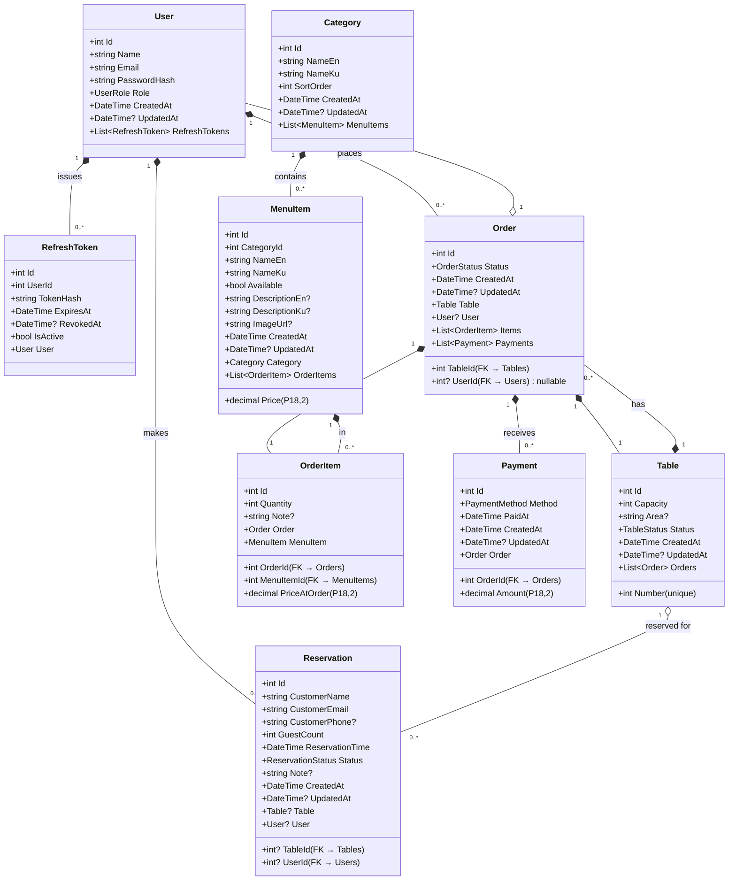
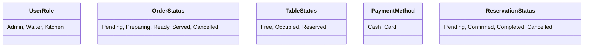
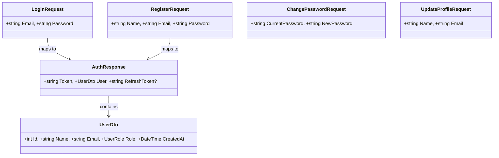
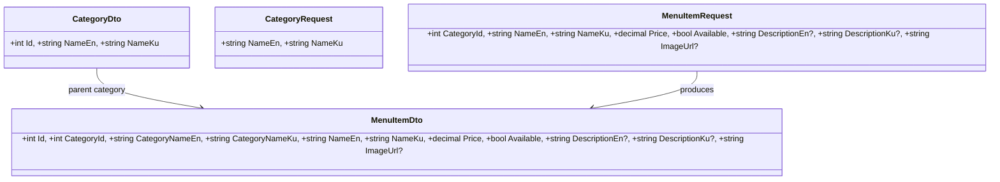
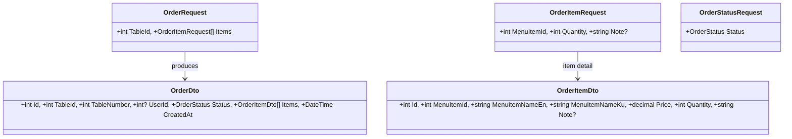
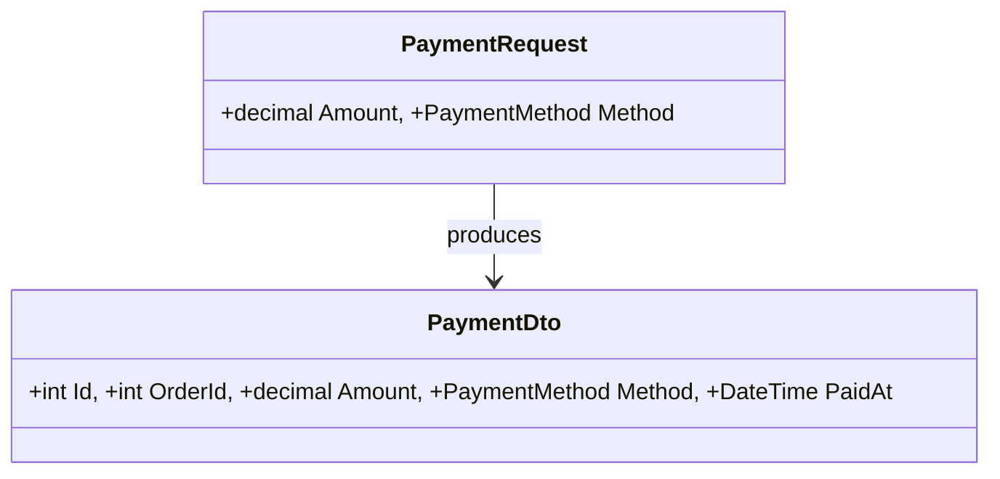
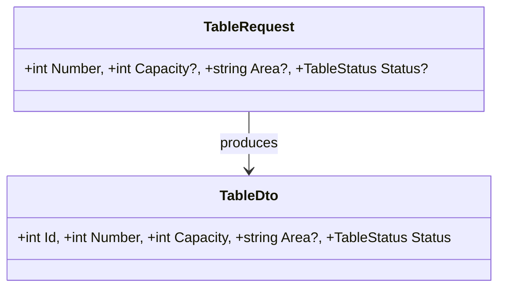
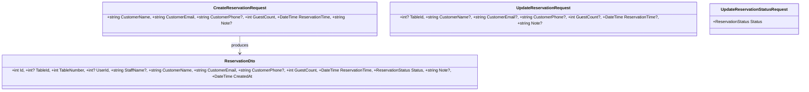
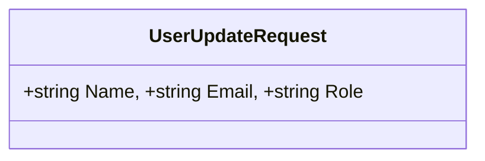

# Domain & Service Model

## 1 — Entity Relationships (Class Diagram)



## 2 — Enums (All Shared Constants)



## 3 — DTOs by Feature

### Auth


### Menu (bilingual EN/KU)


### Orders


### Payments


### Tables


### Reservations (NEW)


### Users


## 4 — Service Contracts (Interfaces)

| Interface | Methods | Layer |
|-----------|---------|-------|
| `IAuthService` | LoginAsync, RegisterAsync, RefreshTokenAsync, RevokeRefreshTokenAsync, GetCurrentUserAsync, ChangePasswordAsync, UpdateProfileAsync | Core → Infra |
| `IOrderService` | GetAllAsync, GetByIdAsync, CreateAsync, UpdateStatusAsync, AddItemAsync, RemoveItemAsync, DeleteAsync | Core → Infra |
| `IMenuService` | GetCategoriesAsync, Create/Update/DeleteCategory, GetMenuItemsAsync, Create/Update/DeleteMenuItem | Core → Infra |
| `ITableService` | GetAllAsync, CreateAsync, UpdateAsync, DeleteAsync | Core → Infra |
| `IPaymentService` | CreateAsync, GetAllByOrderIdAsync | Core → Infra |
| `IUserService` | GetAllAsync, UpdateAsync, DeleteAsync | Core → Infra |
| `IReservationService` | CreateAsync, GetAllAsync (paginated), GetByIdAsync, UpdateAsync, UpdateStatusAsync, DeleteAsync | Core → Infra |
| `IOrderNotifier` | NotifyNewOrder, NotifyOrderStatusChanged | Core (contract) → API (impl via Hub) |
| `IFileStorage` | UploadFileAsync → returns URL/path | Core (contract) → Infra (LocalFileStorage / S3FileStorage) |

## 5 — Mapping Strategy

AutoMapper profiles defined in [MappingProfiles](../../backend/RestaurantApp.Infrastructure/Mappings/MappingProfiles.cs):

```csharp
CreateMap<User, UserDto>().ReverseMap();
CreateMap<MenuItem, MenuItemDto>()
    .ForMember(d => d.CategoryNameEn, opt => opt.MapFrom(s => s.Category.NameEn))
    .ForMember(d => d.CategoryNameKu, opt => opt.MapFrom(s => s.Category.NameKu));
CreateMap<Order, OrderDto>()
    .ForMember(d => d.TableNumber, opt => opt.MapFrom(s => s.Table.Number))
    .ForMember(d => d.Items, opt => opt.MapFrom(s => s.OrderItems));
CreateMap<OrderItem, OrderItemDto>()
    .ForMember(d => d.MenuItemNameEn, opt => opt.MapFrom(s => s.MenuItem.NameEn))
    .ForMember(d => d.MenuItemNameKu, opt => opt.MapFrom(s => s.MenuItem.NameKu))
    .ForMember(d => d.Price, opt => opt.MapFrom(s => s.PriceAtOrder));
```

## 6 — Bilingual Data Model

All menu-facing entities store **bilingual fields** (EN + KU):

| Entity | English Fields | Kurdish Fields |
|--------|---------------|----------------|
| `Category` | `NameEn` | `NameKu` |
| `MenuItem` | `NameEn`, `DescriptionEn` | `NameKu`, `DescriptionKu` |
| `MenuItemDto` | `NameEn`, `DescriptionEn`, `CategoryNameEn` | `NameKu`, `DescriptionKu`, `CategoryNameKu` |

The backend always returns both languages in every response. The frontend selects the active language based on user preference (`lib/i18n/`).

## 7 — Nullable Foreign Keys

The following foreign keys are **nullable by design**:

| Entity | Field | Reason |
|--------|-------|--------|
| `Order.UserId` | `int?` | Supports anonymous orders (e.g., QR-code self-ordering without login) |
| `Reservation.TableId` | `int?` | Reservation can exist before a specific table is assigned |
| `Reservation.UserId` | `int?` | Supports anonymous public reservations (no staff account required) |

---

*Last updated: 2026-06-09 · Generated from source code + architecture analysis*
