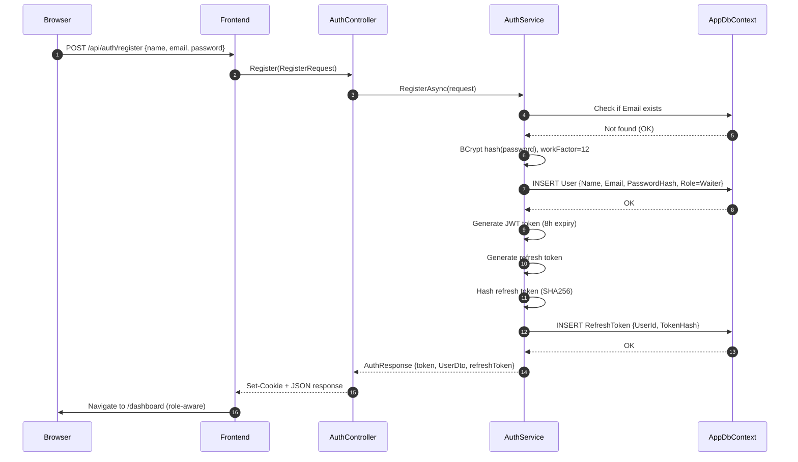
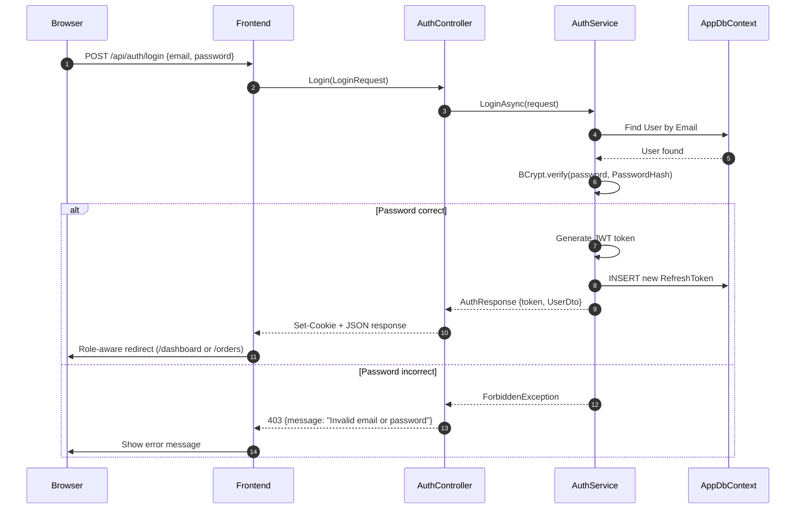
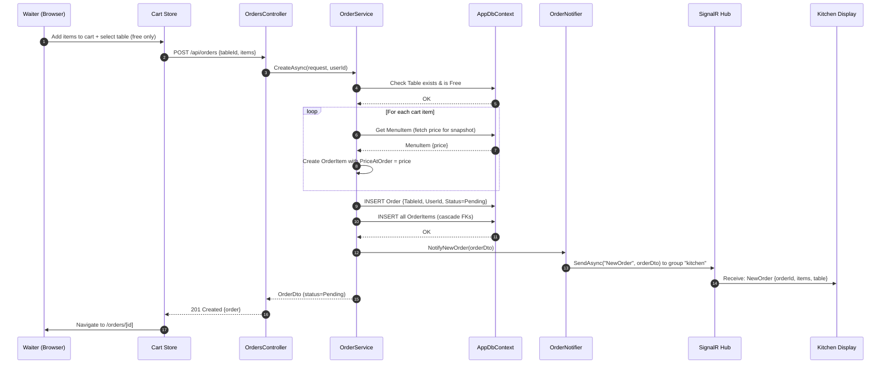
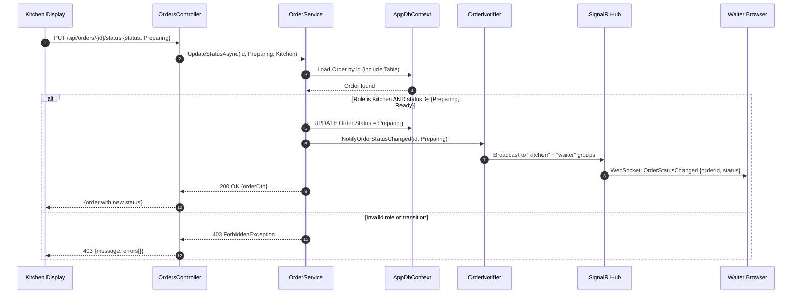
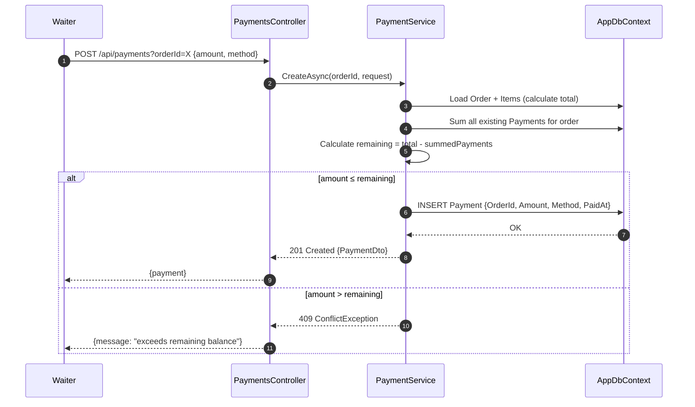
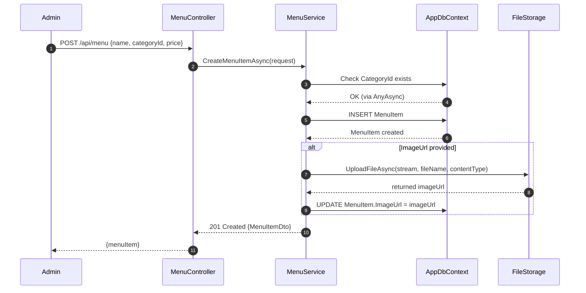
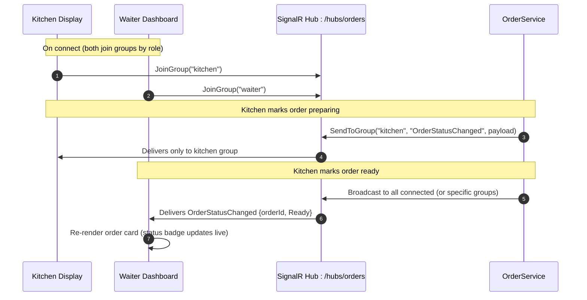

# Sequence Diagrams

## 1 — Registration Flow

**Key details:** New users always receive `UserRole.Waiter`. Refresh token stored as SHA256 hash; raw value in HTTP-only cookie.

---

## 2 — Login Flow

---

## 3 — Create New Order (Core Workflow)

**Critical:** `PriceAtOrder` is captured at creation time. This value never changes even if the menu item price is updated later. The invoice always reflects what was quoted at order time.

---

## 4 — Update Order Status (Kitchen Flow)

---

## 5 — Process Payment (Partial or Full)

**Partial payments supported:** A single order can have multiple `Payment` records with different methods (e.g., part cash, part card). The frontend sums all payments to show progress.

---

## 6 — Admin Menu Item CRUD

---

## 7 — SignalR Real-Time Events

| Event | Payload | Delivered To | Triggered By |
|-------|---------|-------------|--------------|
| `NewOrder` | `OrderDto` | Kitchen group | Order created (pending) |
| `OrderStatusChanged` | `{ orderId, status }` | Kitchen + Waiter groups | Any order status update |

---

*Next: [05-business-processes](./05-business-processes.md)*
