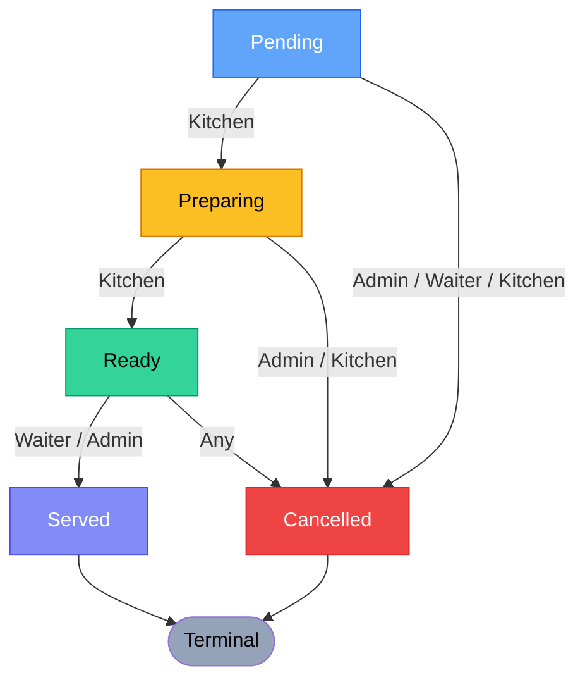
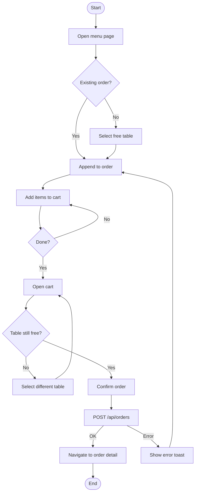
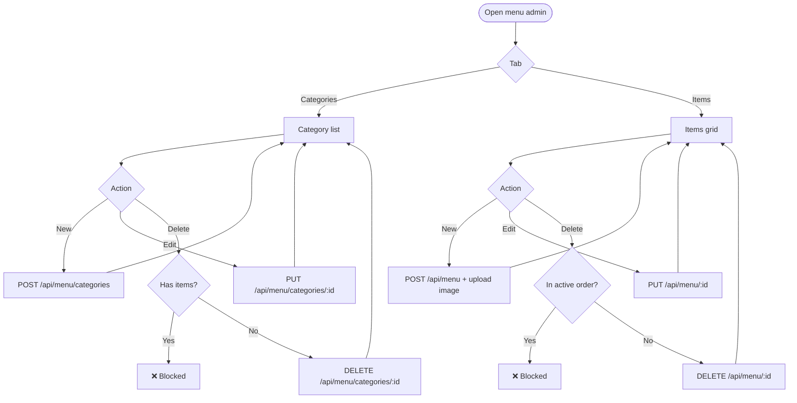
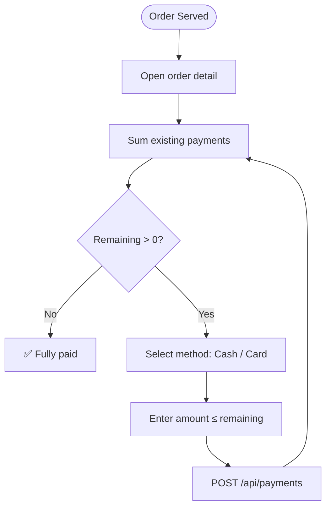
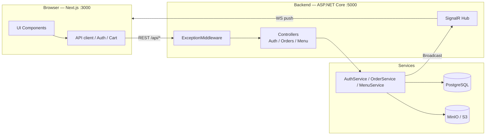

# Business Processes

## 1 — Order Lifecycle

### Transition Matrix

| From | Kitchen | Waiter | Admin |
|------|---------|--------|-------|
| `Pending` | → Preparing | — | → Cancelled |
| `Preparing` | → Ready | — | → Cancelled |
| `Ready` | — | → Served, Cancelled | → Served, Cancelled |
| `Served` | — | — | — |
| `Cancelled` | — | — | — |

---

## 2 — Order Creation (Waiter)

---

## 3 — Menu Management (Admin)

---

## 4 — Role Access Matrix

| Route | Admin | Waiter | Kitchen |
|-------|:-----:|:------:|:-------:|
| `/dashboard` (stats) | ✓ | — | — |
| `/dashboard/users` | ✓ | — | — |
| `/dashboard/restaurant/menu` | ✓ CRUD | ✓ Browse | — |
| `/dashboard/restaurant/cart` | ✓ | ✓ | — |
| `/dashboard/restaurant/tables` | ✓ | — | — |
| `/dashboard/kitchen` | ✓ | — | ✓ |
| Orders list + detail | ✓ | ✓ | — |
| Set status: Preparing / Ready | — | — | ✓ |
| Set status: Served / Cancelled | ✓ | ✓ | ✓ |

---

## 5 — Partial Payment Flow

---

## 6 — End-to-End Request Flow

---

*Next: [01-entity-relationship](../data-model/01-entity-relationship.md)*
