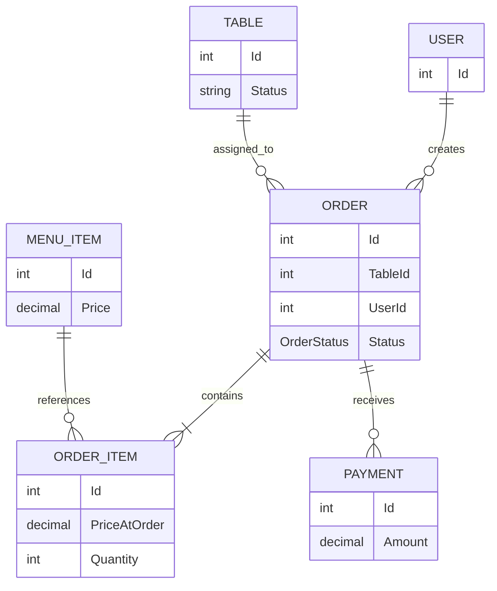
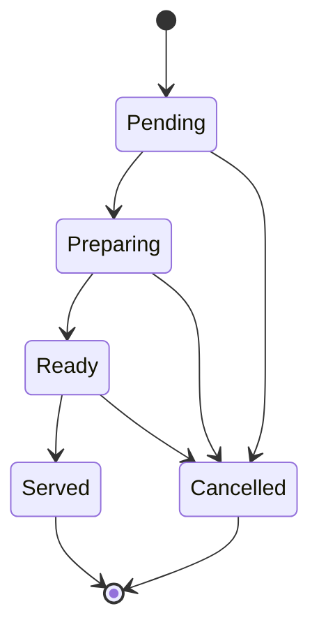
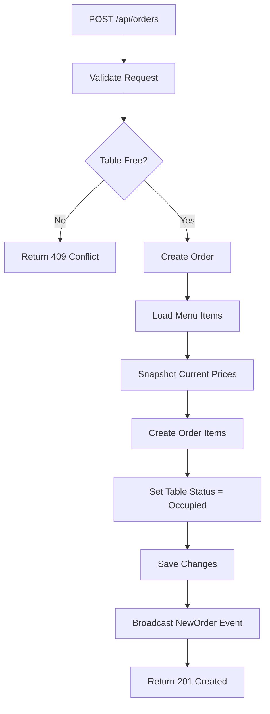
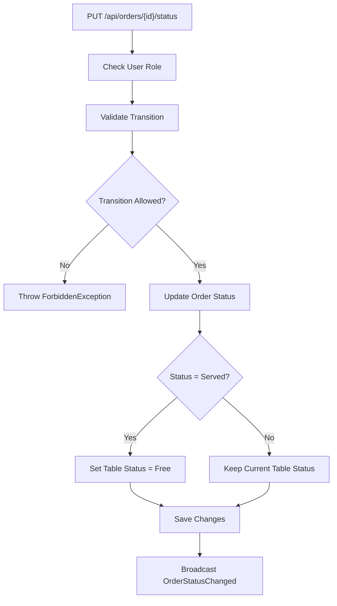
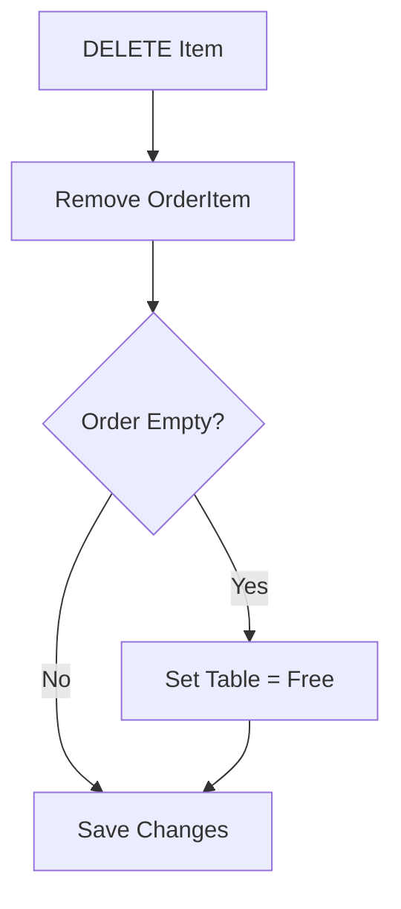
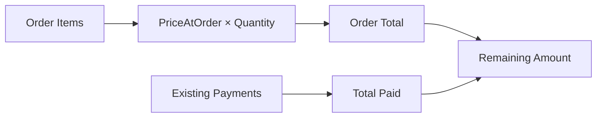
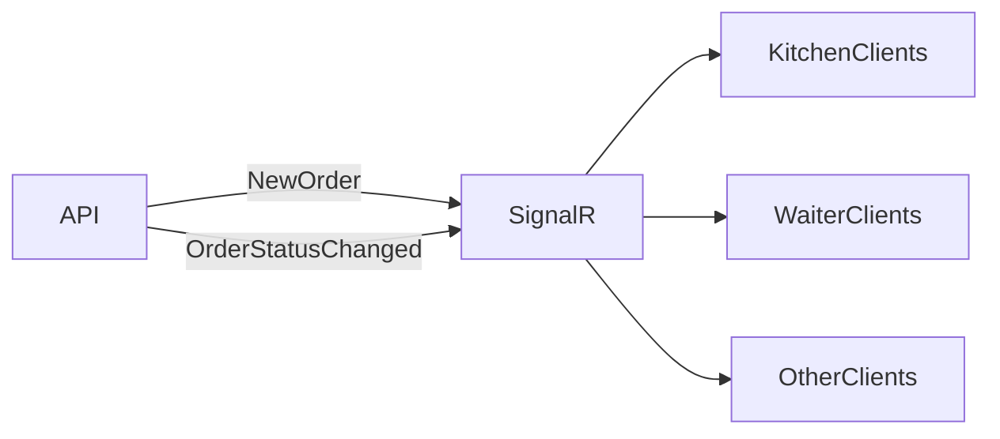
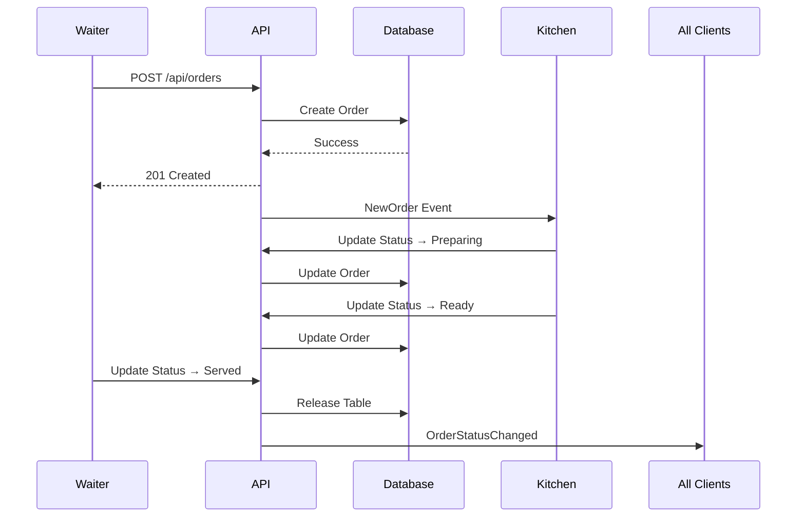

# Order Lifecycle and Business Process

## Entity Relationships



---

## Order Status Flow



---

## Order Creation Flow



---

## Status Update Flow



---

## Add Item Flow

```mermaid
flowchart TD

    A[POST /orders/{id}/items]
        --> B{Order Modifiable?}

    B -- No --> X[403 Forbidden]

    B -- Yes --> C[Validate Menu Item]

    C --> D[Read Current Price]
    D --> E[Create OrderItem]
    E --> F[Store PriceAtOrder Snapshot]
    F --> G[Save Changes]
```

---

## Remove Item Flow



---

## Payment Calculation



---

## Real-Time Communication



---

## Complete Request Lifecycle


